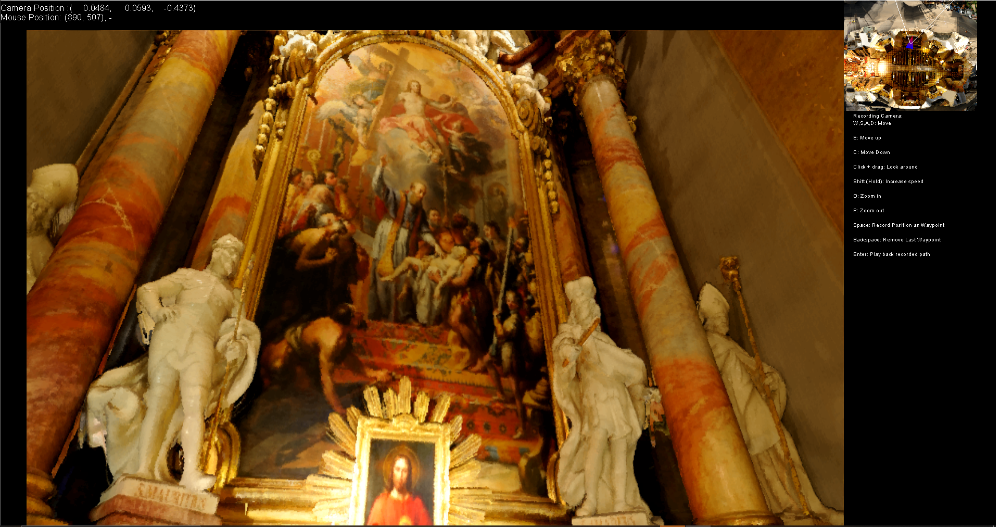

## Python3 udSDK 

<!-- TODO: Write a brief abstract explaining this sample -->
This integration contains several demonstrations of using udSDK renderer in increasingly complex contexts.
The code is written to be as modular as possible and is designed as an interface for udSDK to the Python language and it's libraries.

<!-- TODO: Fill this section below with metadata about this sample-->
```
Language:              Python3
Type:                  Language Example
Contributor:           Euclideon udSDK Development Team <support@euclideon.com>
Organization:          Euclideon, https://euclideon.com/
Date:                  2021-06-14
udSDK Version:         2.1
Toolsets:              IPython 3.8 Pillow Pyglet Numpy IPython3
```

## Resources Required
<!-- TODO: Fill this section below with the resources required to do this sample-->
This resource requires Euclideon udSDK and the following Python libraries to be installed for python 3.8:

### Install Euclideon udSDK
Euclideon udSDK can be obtained from [here](https://www.euclideon.com/udsdk/)

Set the system variable for `UDSDK_HOME` on your operating system to the folder that udSDK was downloaded to. The SDK functionality 
can be

#### Windows
On Windows, run command prompt as administrator and then run the command:
The following can also be achieved using the environment variables dialog.
`setx UDSDK_HOME "[path to udSDK]"`

e.g.

`setx UDSDK_HOME "C:\Euclideon_udSDKX.XX"`

#### Linux
Add the following command to your `.bashrc`

`export UDSDK_HOME="[path to udSDK]"`

Restart your terminal or open a new one

### Configure Python
The following packages are required to run the contained packages.

- pillow (formerly PIL)

- Pyglet

- Numpy (or Scipy)

- Ipython3

All packages are available through the pip repository and can be installed via 

`pip install ipython pyglet pillow scipy`

## How to use the sample
<!-- TODO: Explain how this sample can be used and what is required to get it running -->
# udSDK.py

This is the low level wrapper for udSDK to python. It implements a subset of the available C library as Python classes. Not all functionality
of udSDK is currently implemented in this file. See the udSDK documentation for a full list of exposed functions.

#### basicRender.py

This file contains the basic usage of udSDK for rendering a UDS and writing it to file using Pillow.
It demonstrates low level usage of functions and is a good starting point for users wanting to fully understand the process of generating a render using udSDK

Usage: `python3 main.py yourudStreamusername yourudStreampassword [pathtoUDS]` will run the sample code and write an image using the udSDK Renderer

As this is a low level wrapper the test code is designed to work with `DirCube.uds` located in the udSDK
#### easyrenderer.py
This file contains a python object wrapper `EasyRenderer` which automates many commonly set features and renders a UDS 
to a set of images. It is intended as a demonstration of generating renderings from UDS files.

### Python Client

This example includes and example client written in python using the above wrappers for udSDKs libraries. It is intended as a starting point
for udSDK users wanting to develop their own client implementations and is designed to be easily extensible using python. It relies on numpy
and pyglet libraries in addition to udSDK and Pillow

The integration can be run by running the following in console from the main directory:

`ipython3 [udStreamUsername] [udStreamPassword]`

UDS files can then be loaded by dragging and dropping from your OS shell (Explorer on Windows) into the window that is created.



Controls are described for each camera type on the right hand side of the screen, the camera type can be changed using `tab`.
The terminal used to start the program can be used to directly modify the behaviour of the running program. 

The best way to familiarise yourself with the features of udSDK's python wrapper is to explore the `if name == "__main:` section of pygletExample.py. Examples of usage can be found in the [blog](https://www.euclideon.com/category/python/) 
#### pygletexample.py
A basic python client for viewing UDS models made using pyglet (an openGL wrapper for python). It makes use of the EasyRender object interface
`App` represents the window context that the application runs in. It handles all user input and manages dispaches the draw commands to the
various UI objects.
`UDViewPort` and it's derived objects represents an OpenGL quad which is to be textured using the frame buffer written to by each call of udRenderContext.Render

When this file is run as a python script (i.e. by running `python3 pygletexample.py` with the appropriate python environment set up, the calling
terminal is transferred to an IPython session with access to the namespace of current session. This allows the user control
of the session from the terminal. For example, to change the camera object the main viewport is attached to the user may run
`main.set_camera(OrthoCamera)` to change the type of camera to the Orthographic projection camera. 


#### Camera.py
Contains camera classes for use with the python. For the purposes of this example  The class definitions included in this file are designed to be extended using python's inheritance features.
Each object inherits from the base `Camera` class to allow overwriting of object methods to achieve different effects and control schemes.

`Camera` is a basic camera class implementing a perspective camera with standard controls


`OrthoCamera` subclasses Camera and overwites the behaviour when setting the projection matrix of the render to Orthographic.
This mode displays all parts of the model at the same scale regardless of the distance from the camera (i.e. ignoring perspective)
As such the camera 'moving' in space corresponds only to moving the locations of the planes that define the box that the user sees.


`OrbitCamera` sublasses `Camera` and modifies the method for determining camera movement direction such that it orbits about a fixed point in space.

`MapCamera` Inherits from the `OrthoCamera` We add an additional parameter to this camera `target` which
is a reference to another camera that the MapCamera sets its position to be above and looking directly down on to.
It intended to be used in conjunction with `UDMapPort` to produce the Map UI element in the sample.


## UDSDK Conversion and Export Examples
The examples folder contains several examples of the use of the high level functionality of UDSDK's Python wrapper. A separate 
readme is included within this folder.

## Supported Modules and Notes

This wrapper constitutes a subset of the larger udSDK C API. More complete documentation for wrapped functions can be found 
in the udSDK header files included with the current udSDK distribution

The following modules are currently 

<!-- End -->
